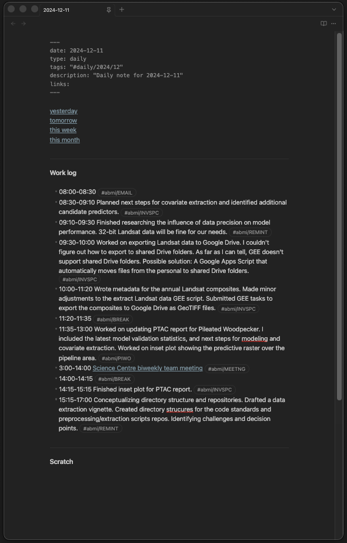

# Obsidian Vault

**Periodic notes**: Daily, weekly, and monthly notes.

Organized using the  **PARA** method:
- **Projects** for action focused work with deadlines, 
- **Areas** for ongoing work
- **Resources** for all reference materials
- **Archive** for completed work

Various markdown note templates for [obsidian](https://obsidian.md/). 

---
### Community Plugins

The vault takes advantage of the following community plugins:

- **Better Export PDF**
- **Better Word Count**
- **Chronology**
- **Dataview**
- **Multi-Column Markdown**
- **Numerals**
- **Advanced Slides**
- **Day Planner**
- **Excel to Markdown Table**
- **File Link**
- **Hotkeys for Templates**
- **Minimal Settings**
- **Pandoc**
- **Pandoc Reference List**
- **Projects**
- **Tasks Plugin**
- **Table Editor Obsidian**
- **Tag Wrangler**
- **Templater-Obsidian**

Stored in this [github repo]

---
## Periodic notes

### Daily note

Daily notes are generated from the template [[daily_note]]. The Work Log in the daily note is used to inform weekly and monthly work summaries.

#### Components of the Daily Note

##### Metadata
The metadata section at the top of the file contains key-value pairs in YAML format to provide context and structure to the note.

- **`date`**: Stores the date of the note in YYYY-MM-DD format.
- **`type`**: Specifies the note type as `daily`.
- **`tags`**: Automatically generates a hierarchical tag for the note based on the year and month.
- **`description`**: "Daily note for YYYY-MM-DD"

##### Navigation Links
A set of quick-access links to related time-based notes:
- **Yesterday**: Links to the previous day's note.
- **Tomorrow**: Links to the next day's note.
- **This Week**: Links to the weekly note for the current week.
- **This Month**: Links to the monthly note for the current month.

##### Work Log
A section for documenting work activities with timestamped entries. The log includes:
- **Time Entries**: Entries formatted as `HH:MM-HH:MM` to track work periods.
- **Tagging**: Ensures each entry includes a relevant tag (e.g., `#abmi` for organization-specific tasks).
- **Break Monitoring**: Tracks and calculates total break time against a predefined limit.

##### Automated Validations
A DataviewJS script is included in the daily note to validate the work log and flag entry errors:
- **Warnings**:
  - Missing tags (e.g., `#abmi`).
  - Improper time formats.
  - Missing descriptions for entries.
- **Break Time Monitoring**:
  - Computes the total break time from entries tagged as `#abmi/BREAK`.
  - Displays a warning if break time exceeds or falls below the allowed maximum.
##### Scratch
A freeform space for notes, ideas, or temporary content not bound to a specific structure.

---
### Weekly Note

### Monthly Note