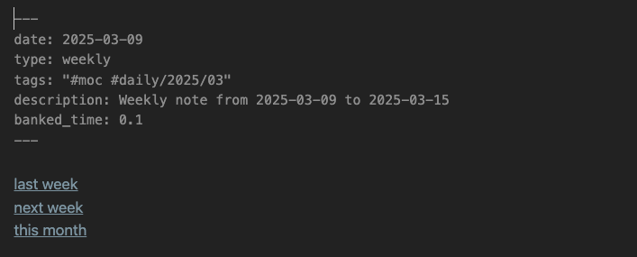
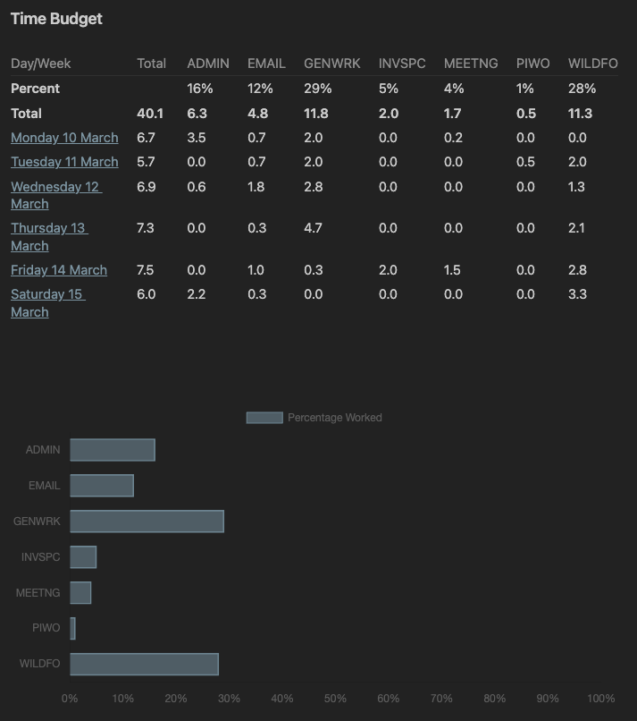
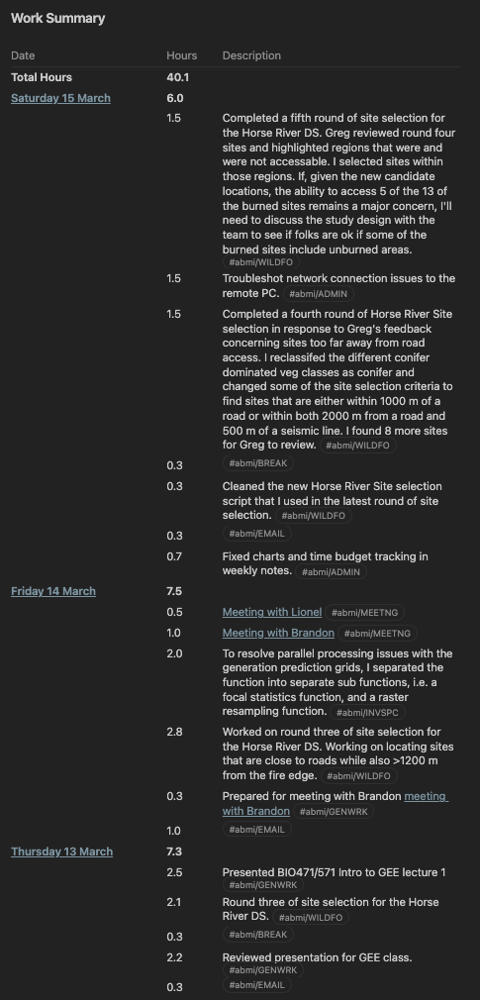
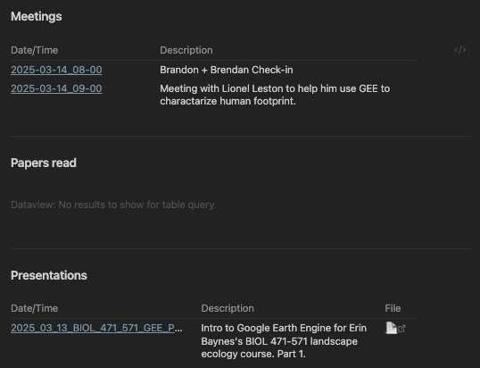
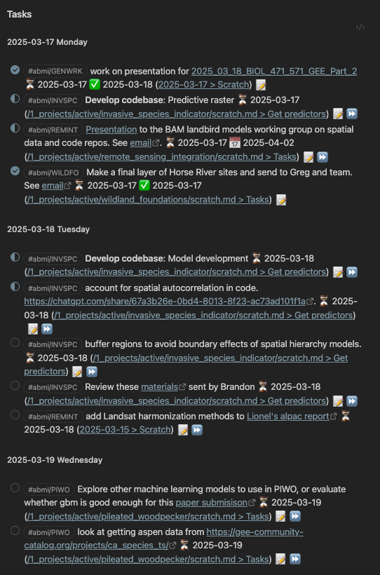

# Obsidian Vault

## Table of Contents
- [Overview](#overview)
- [Dependencies](#dependencies)
- [Periodic notes](#periodic-notes)
  - [Daily note](#daily-note)
  - [Weekly Note](#weekly-note)
  - [Monthly Note](#monthly-note)
- [Templates](#templates)

---

## Overview
My [obsidian](https://obsidian.md/) vault structure.

It includes:
- **Periodic notes**: Daily, weekly, and monthly notes.

- Notes organized using the  **PARA** method:
  - **Projects** for action focused work with deadlines, 
  - **Areas** for ongoing work
  - **Resources** for all reference materials
  - **Archive** for completed work

- Various markdown note templates

  
---

## Dependencies

The vault takes advantage of the following community plugins:

- **Better Export PDF**
- **Better Word Count**
- **Chronology**
- **Dataview**
- **Multi-Column Markdown**
- **Numerals**
- **Advanced Slides**
- **Day Planner**
- **Excel to Markdown Table**
- **File Link**
- **Hotkeys for Templates**
- **Minimal Settings**
- **Pandoc**
- **Pandoc Reference List**
- **Projects**
- **Tasks Plugin**
- **Table Editor Obsidian**
- **Tag Wrangler**
- **Templater-Obsidian**

---
## Periodic notes

### Daily note

Daily notes are generated from the template [[daily_note]]. The Work Log in the daily note is used to inform weekly and monthly work summaries.

#### Components of the Daily Note

##### Metadata
The metadata section at the top of the file contains key-value pairs in YAML format to provide context and structure to the note.

- **`date`**: Stores the date of the note in YYYY-MM-DD format.
- **`type`**: Specifies the note type as `daily`.
- **`tags`**: Automatically generates a hierarchical tag for the note based on the year and month.
- **`description`**: "Daily note for YYYY-MM-DD"

##### Navigation Links
A set of quick-access links to related time-based notes:
- **Yesterday**: Links to the previous day's note.
- **Tomorrow**: Links to the next day's note.
- **This Week**: Links to the weekly note for the current week.
- **This Month**: Links to the monthly note for the current month.

##### Work Log
A section for documenting work activities with timestamped entries. The log includes:
- **Time Entries**: Entries formatted as `HH:MM-HH:MM` to track work periods.
- **Tagging**: Ensures each entry includes a relevant tag (e.g., `#abmi` for organization-specific tasks).
- **Break Monitoring**: Tracks and calculates total break time against a predefined limit.

##### Automated Validations
A DataviewJS script is included in the daily note to validate the work log and flag entry errors:
- **Warnings**:
  - Missing tags (e.g., `#abmi`).
  - Improper time formats.
  - Missing descriptions for entries.
- **Break Time Monitoring**:
  - Computes the total break time from entries tagged as `#abmi/BREAK`.
  - Displays a warning if break time exceeds or falls below the allowed maximum.
##### Scratch
A freeform space for notes, ideas, or temporary content not bound to a specific structure. 

### Weekly Note

The weekly note summarizes work and tasks for a given week. It uses the `dataview` plugin to:
- extract text from the daily notes into work summaries. 
- Summarize the week's meetings
- Summarize the week's presentations
- Summarize the scientific papers read

The `Tasks` plug in is used to show open, completed, and in-progress tasks. 
#### Components of the Weekly Note

##### Metadata

The metadata section at the top of the file contains structured YAML fields to provide context and enable programmatic querying across weekly notes.

- **`date`**: The start date of the week (Monday) in `YYYY-MM-DD` format.
- **`type`**: Specifies the note type as `weekly`.
- **`tags`**: A hierarchical tag based on the year and month (e.g., `#periodic/2025/03`).
- **`description`**: A general descriptor such as `"Weekly note for YYYY-MM-DD to YYYY-MM-DD"`.
##### Navigation Links

Quick-access links to time-based references for ease of navigation:

- **Previous Week**: Links to the prior week’s note.
- **Next Week**: Links to the upcoming week’s note.
- **This Month**: Links to the monthly note that contains this week.

##### Time Budget

A table showing the number of hours spent working on active projects and common work tasks. The table is populated using the `dataview` plugin to summarize the bulleted time entries from the daily notes. This section also includes a horizontal bar graph describing the percentage of time spent on each active project for the week.

##### Work Summary

A table with descriptions of all of the tasks done over the week sorted by day of the week. The table also displays the time spent on each task. The table is populated using the `dataview` plugin to summarize the bulleted time entries from the daily notes. 

##### Meetings
A list of the week's meetings.

##### Papers read
A table showing the scientific paper's read during the week. 
##### Presentations
A table showing all of the presentations given over the week. 

##### Tasks
The week's  tasks pulled from notes all over the obsidian vault using the `Tasks` plugin. Tasks are organized by day of the week. 

### Monthly Note

---
## Templates

This vault includes templates that use the `templater` and `dataview` plugins to autogenerate markdown documents. Templates include the periodic notes described above. They are stored in the 5_system/templates folder.

### [writing.md](https://github.com/bgcasey/obsidian_vault/blob/main/5_system/templates/writing.md)

This template is used for creating documents that store pieces of writing. 

**Frontmatter:**
- `title`: Auto-formatted title
- `date`: Creation date
- `type`: writing
- `tags`: Empty
- `description`: Empty
- `wordcountgoal`: Empty
- `prompt`: Empty
- `status`: Empty
- `previous`: Empty
- `next`: Empty

### [daily_note.md](https://github.com/bgcasey/obsidian_vault/blob/main/5_system/templates/daily_note.md)
This template is designed for daily notes.

**Frontmatter:**
- `date`: Current date
- `type`: daily
- `tags`: Daily note tags
- `description`: Daily note description

**Sections:**
- Links to previous/next days, weeks, and months
- Work log with automated checks and warnings
- Scratchpad

### [peer_review.md](https://github.com/bgcasey/obsidian_vault/blob/main/5_system/templates/peer_review.md)
This template is for perming peer review on manuscripts for science publications.

**Frontmatter:**
- `title`: Auto-formatted title
- `date`: Fixed date
- `type`: general
- `tags`: Peer review tags
- `description`: Peer review description
- `wordcountgoal`: Fixed word count goal

**Sections:**
- Link to manuscript
- Summary of research and overall impression
- Strengths and weaknesses
- Discussion of specific areas for improvement
- Recommended course of action

### [project_moc.md](https://github.com/bgcasey/obsidian_vault/blob/main/5_system/templates/project_moc.md)
This template is for creating a Map of Content (MOC) for projects. 

**Frontmatter:**
- `title`: about
- `date`: Creation date
- `type`: MOC
- `status`: Empty
- `tags`: Empty
- `description`: Project MOC description

**Sections:**
- About
- Meetings
- Presentations
- Notes
- Writing
- Literature
- Tasks

### [weekly_note.md](https://github.com/bgcasey/obsidian_vault/blob/main/5_system/templates/weekly_note.md)
This template is for weekly notes. It provides summarizes work that has been done and needs to be completed for the week. 

**Frontmatter:**
- `date`: Start date of the week
- `type`: weekly
- `tags`: Weekly note tags
- `description`: Weekly note description
- `banked_time`: Empty

**Sections:**
- Links to previous/next weeks and current month
- Time budget with tracked work time
- Work summary
- Meetings
- Papers read
- Presentations
- Tasks

### [general_note.md](https://github.com/bgcasey/obsidian_vault/blob/main/5_system/templates/general_note.md)
This template provides basic frontmatter for general notes. 

**Frontmatter:**
- `title`: Auto-formatted title
- `date`: Creation date
- `type`: general
- `tags`: Empty
- `description`: Empty

### [meeting_note.md](https://github.com/bgcasey/obsidian_vault/blob/main/5_system/templates/meeting_note.md)
This template is for meeting notes. It extracts information from calendar entries pasted into the text body to auto-generate the file name and frontmatter fields.

**Frontmatter:**
- `date`: Extracted meeting date
- `type`: meeting
- `tags`: Daily note tags
- `attendees`: Empty list
- `description`: Extracted description

**Sections:**
- Agenda/Questions
- Notes

### monthly_note.md

This template is for monthly summaries.

**Frontmatter:**
- `date`: Start of the month
- `type`: monthly
- `tags`: Monthly note tags
- `description`: Monthly note description
    
**Sections:**
- Banked time summary
- Work accomplished
- Writing done
- Meetings attended
- Tasks completed and carried forward
  
 ### reference_note.md

This template is for referencing academic papers or resources. It autogenerates based on a bibtex entry. 

**Frontmatter:**
- `title`: Auto-formatted based on citation key or document title
- `date`: Creation date
- `type`: reference
- `tags`: Reference tags (e.g. `literature`)
- `zotero`: Citation key
- `authors`: Comma-separated list of authors
- `year`: Year of publication
- `publication`: Journal or source
- `status`: Reading status (e.g., `to read`, `in progress`, `done`)
- `description`: Summary or main points
    
**Sections:**
- Summary
- Annotations from Zotero PDFs
  
### supervisor_meeting.md

This template is for meetings with a supervisor. The front matter autogenerates from a pasted apple calendar entry.

**Frontmatter:**
- `date`: Meeting date
- `type`: meeting
- `tags`: Supervisor meeting tags
- `attendees`: Typically includes supervisor and author
- `description`: Short meeting purpose or context
    
**Sections:**
- Agenda
- Work summary that is automatically generated from the text of daily notes. 
